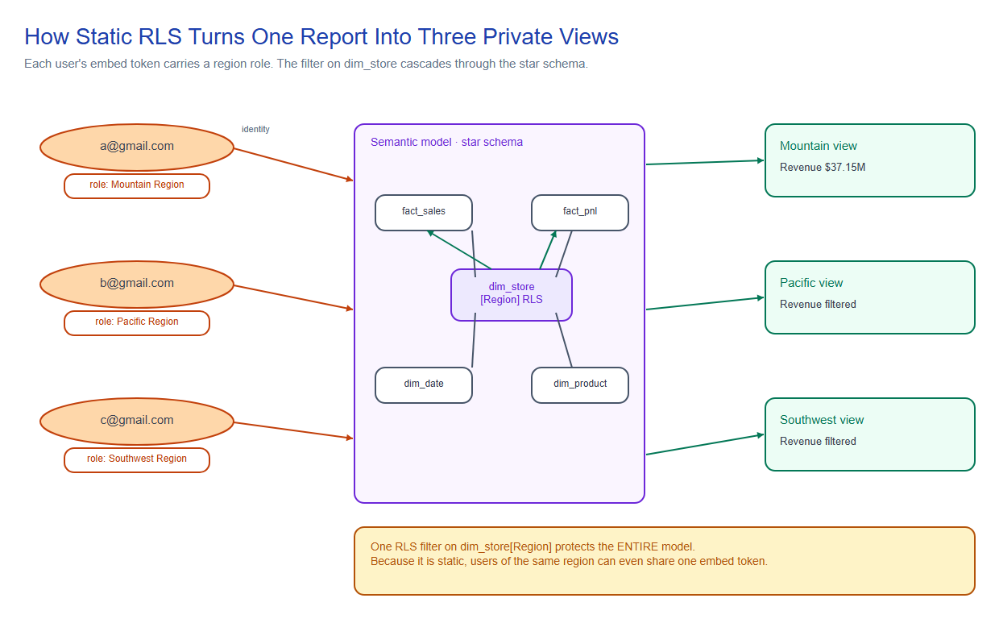
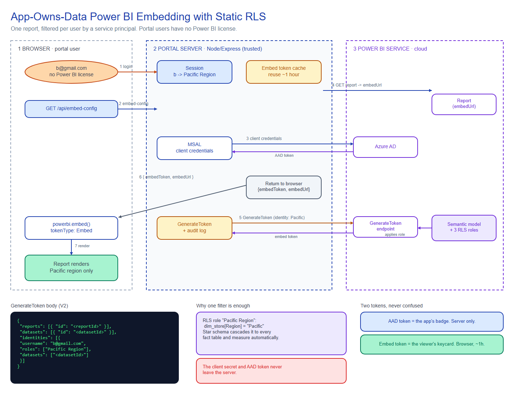
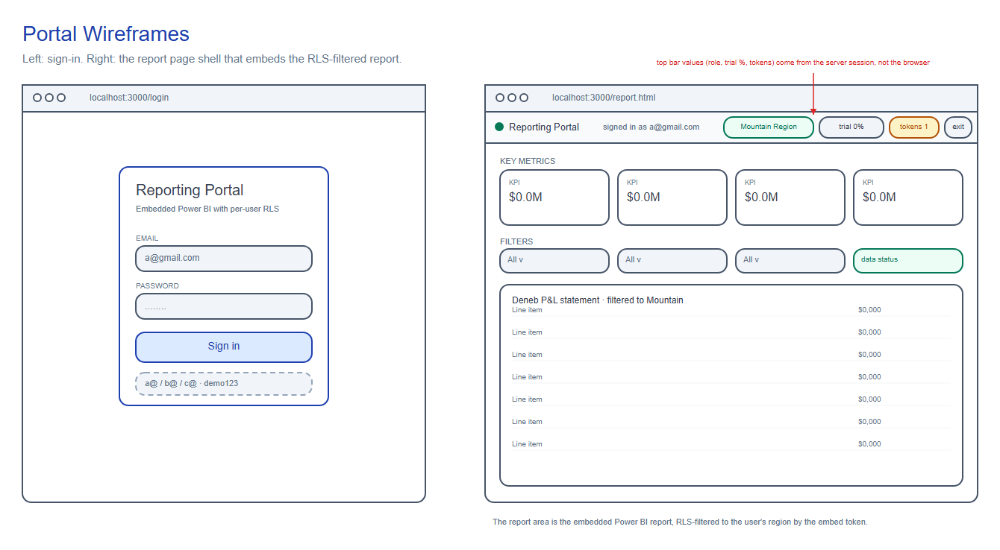

# PowerBI Static RLS Magic

> **Embed one Power BI report and show every viewer only their own slice of the data, without giving a single viewer a Power BI license.**

A complete, working proof of concept of the Power BI **"embed for your customers" (app-owns-data)** pattern with **static Row-Level Security (RLS)**. A small web portal signs users in, and each one sees the same embedded report filtered to just their region. Users are plain application logins (no Azure AD account, no Power BI license). The app authenticates to Power BI with a **service principal** and mints a per-user **embed token** that carries the right RLS role.

It runs on a free **PPU / trial embed token** setup (no dedicated capacity), so it also demonstrates **embed-token conservation**, which matters when the trial pool is finite.

Everything is built on a fictional retailer, **TrailPeak Outfitters**, with a fully synthetic star-schema model. Nothing here is real customer data.



*One report, one model, three private views. Each user's embed token carries their region role, and the filter on `dim_store` cascades through the star schema.*

---

## Table of Contents

1. [What This Project Is](#1-what-this-project-is)
2. [The Core Idea in Plain English](#2-the-core-idea-in-plain-english)
3. [Architecture and Request Flow](#3-architecture-and-request-flow)
4. [How Static RLS Actually Filters the Data](#4-how-static-rls-actually-filters-the-data)
5. [Repository Structure](#5-repository-structure)
6. [Prerequisites](#6-prerequisites)
7. [Configuration: the .env file](#7-configuration-the-env-file)
8. [Setup Walkthrough, Step by Step](#8-setup-walkthrough-step-by-step)
9. [Adding the RLS Roles to the Published Model](#9-adding-the-rls-roles-to-the-published-model)
10. [Running the App](#10-running-the-app)
11. [The 3-User Acceptance Test](#11-the-3-user-acceptance-test)
12. [API Reference](#12-api-reference)
13. [How the Code Works](#13-how-the-code-works)
14. [Embed Token Economics and Conservation](#14-embed-token-economics-and-conservation)
15. [Security Model](#15-security-model)
16. [What Can Go Wrong: Troubleshooting and Failure Modes](#16-what-can-go-wrong-troubleshooting-and-failure-modes)
17. [Scaling to Production](#17-scaling-to-production)
18. [Static vs Dynamic RLS](#18-static-vs-dynamic-rls)
19. [Admin Scripts Reference](#19-admin-scripts-reference)
20. [FAQ](#20-faq)
21. [Tech Stack](#21-tech-stack)
22. [Data and Attribution](#22-data-and-attribution)

---

## 1. What This Project Is

### The problem it solves

You have one Power BI report. You want many external people to open it, and each should see **only their own data**. But those people are **not** Power BI users: they have no license, no Azure AD account, they are just rows in your application's user list. So how does Power BI filter data for someone it has never heard of?

That is exactly what the **"embed for your customers" (app-owns-data)** pattern is for. Your **application owns the Power BI identity and the data**, and vouches for each visitor. The visitor never touches Power BI directly.

### What you get in this repo

- A runnable Node/Express portal that logs users in and embeds a report filtered per user.
- Three demo users, each mapped to a **static RLS role** (a US sales region).
- **Service principal** authentication (client credentials), so no user needs a Power BI license.
- **Embed-token caching and logging**, because on a free trial the token pool is finite.
- The full **Power BI model and report** (PBIP + PBIX) with the RLS roles defined, plus the synthetic data.
- Admin scripts that add the RLS roles to a **published** model in place through the Fabric REST API, no Power BI Desktop required.

### Who it is for

- Developers building a customer-facing portal that embeds Power BI.
- Anyone learning app-owns-data embedding and RLS who wants a working reference, not just docs.
- People on a **PPU license with no capacity** who need to prototype embedding on trial tokens.

---

## 2. The Core Idea in Plain English

Think of it like a hotel.

- **Your portal (the Node app)** is the **front desk**. It checks who is logging in and hands out keycards.
- **The service principal** is the app's **staff badge**. A robot account allowed into Power BI's back office. Nobody logs in "as" it; your server uses it silently.
- **The semantic model with its RLS roles** is the **building**, and each role is a **floor**. "Pacific Region" is the floor that only shows Pacific data.
- **The embed token** is a **keycard**. Programmed for one visitor, opens only their floor, and expires in about an hour.

The visitor (the browser) holds the keycard but cannot reprogram it. That is the security.

### Two tokens, never confused

This is the single most important thing to understand:

| Token | What it is | Where it lives |
|---|---|---|
| **AAD token** | The staff badge. Proves "I am the app" to the Power BI API. | **Server only.** Never sent to the browser. |
| **Embed token** | The keycard. Says "render this report, filtered as Pacific Region, for the next hour." | Sent to the browser, that is its whole job. |

If the AAD token or the client secret ever reached the browser, an attacker could impersonate your whole app. The embed token is safe to send because it is scoped to one report and one RLS role, and it expires quickly.

---

## 3. Architecture and Request Flow



*The full request flow across the browser, the trusted portal server, and Power BI, including the two-token model, the GenerateToken body, and the security boundary. Text version below.*

```
browser (login)              portal server (Node/Express)                 Power BI
   |  POST /api/login  ─────────►  check user, map email -> RLS role, start session
   |
   |  GET  /api/embed-config ───►  1. MSAL client-credentials ───────────►  AAD token
   |                               2. GET report ────────────────────────►  embedUrl
   |                               3. POST /GenerateToken with identity:
   |                                    { username, roles:[<region role>], datasets:[id] }
   |                                                          ◄────────────  embed token
   |  ◄─── { embedToken, embedUrl, reportId }
   |       (client secret + AAD token NEVER cross this line)
   |
   |  powerbi.embed(container, { accessToken: embedToken,
   |                             tokenType: Embed }) ────────────────────►  filtered report
```

Step by step, when `b@gmail.com` opens the report:

1. **Login.** The browser posts email + password. The server checks the hardcoded user list, sees `b@gmail.com -> "Pacific Region"`, and starts a session.
2. **Ask for an embed config.** The browser calls `GET /api/embed-config`.
3. **Get an AAD token.** The server uses MSAL client credentials (the service principal + secret) to get an AAD token for the Power BI API. MSAL caches this internally.
4. **Get the embed URL.** The server calls `GET /reports/{id}` once and caches the report's `embedUrl`.
5. **Generate the embed token (the key call).** The server calls `POST /GenerateToken` with an **identity** block: `{ username: "b@gmail.com", roles: ["Pacific Region"], datasets: [datasetId] }`. Power BI mints a token with "Pacific Region" baked in.
6. **Return only safe values.** The server sends the browser `{ embedToken, embedUrl, reportId }`. The secret and the AAD token stay server-side.
7. **Embed.** The browser calls `powerbi.embed(...)` with `tokenType: Embed`. The report renders, already filtered to Pacific.

---

## 4. How Static RLS Actually Filters the Data

An RLS role is just a **saved DAX filter** on a table. In this project, "Pacific Region" is:

```dax
dim_store[Region] = "Pacific"
```

When the embed token carries `roles: ["Pacific Region"]`, Power BI applies that filter to `dim_store` for every query the viewer makes.

### The star schema does the rest

Because the model is a **star schema**, `dim_store` is related to every fact table (`fact_pnl_actuals`, `fact_sales`, and so on). Filtering `dim_store` to Pacific **cascades** automatically: revenue, cost of goods sold, the whole P&L, every KPI card, all of it recalculates for Pacific only. You wrote the filter on **one** dimension column and it protected the **entire** model.

The report itself has no idea "b" exists. It only knows "apply the Pacific Region role." Your server is the only thing that maps `b@gmail.com -> Pacific Region`, and it does that from the authenticated session, which the browser cannot tamper with.

### Why it is called "static"

The three roles have **fixed filters** baked in (Mountain, Pacific, Southwest). Which role you pass decides the filtering, so in the `GenerateToken` call the `username` is just a required label (it can be anything), and `roles: [...]` does all the work. Contrast this with **dynamic** RLS, which reads `USERNAME()` inside the DAX so one role serves everyone. See [Static vs Dynamic RLS](#18-static-vs-dynamic-rls).

---

## 5. Repository Structure

```
PowerBIStaticRLSMagic/
├── README.md                         ← you are here (the overview)
├── .gitignore
├── Local Reporting portal/           ← THE APP. start here.
│   ├── server.js                     ← backend: login, embed-config, token cache, logging, token-usage
│   ├── config.js                     ← demo users + email->role map + IDs from .env
│   ├── add-rls-roles.js              ← admin tool: add RLS roles to the PUBLISHED model via Fabric API
│   ├── inspect-report.js             ← admin tool: dump published report pages / backgrounds / resources
│   ├── package.json / package-lock.json
│   ├── .env.example                  ← copy to .env and fill in
│   ├── README.md                     ← the app's own detailed run guide
│   └── public/
│       ├── login.html                ← sign-in page
│       ├── report.html               ← embed shell (top bar + report container)
│       ├── app.js                    ← powerbi-client embed logic + token refresh
│       └── styles.css
├── Report/                           ← the Power BI Project (PBIP)
│   ├── Report.SemanticModel/         ← the model, incl. definition/roles/*.tmdl (the 3 RLS roles)
│   ├── Report.Report/                ← the report pages/visuals (PBIR)
│   └── Design Asset/                 ← canvas backgrounds, wireframes, layout guide
├── Report (DENEB VERSION).pbix       ← the report as a PBIX (open in Desktop)
├── Report (HTML VERSION).pbix
├── data/                             ← synthetic TrailPeak CSVs the model is built from
└── diagrams/                         ← Excalidraw source (.excalidraw) + PNG exports used in this README
```

### What is deliberately NOT in the repo

Secrets and machine state are git-ignored:

- `Local Reporting portal/.env` (the client secret and all resource IDs)
- `node_modules/`
- `generate-token.log` (runtime log)
- Power BI `.pbi/` caches and `*.abf`

The repo was verified to contain **none** of the client secret and **none** of the workspace/report/dataset/service-principal IDs. Copy `.env.example` to `.env` and supply your own.

---

## 6. Prerequisites

You need four things in place once. None of them require Power BI **API permissions** on the app registration, access is governed by the tenant setting and the workspace role, not by delegated/application permissions.

### 6.1 A service principal (Entra ID app registration)

- Azure Portal -> App registrations -> New registration.
- Single tenant. **No redirect URI.** **No API permissions.**
- Create a **client secret** and copy its **Value** immediately (shown only once).
- You will use: **Tenant ID**, **Client ID**, **Client secret**.

### 6.2 Tenant setting: service principals can call Fabric APIs

- Power BI / Fabric admin portal -> Tenant settings -> Developer settings.
- Enable **"Service principals can call Fabric public APIs"** (older label: "Allow service principals to use Power BI APIs").
- Scope it to the whole organization or to a security group that contains your service principal.
- You need to be a **Fabric administrator** to change this. Changes can take a few minutes to propagate.

### 6.3 The service principal must have a workspace role

- In the workspace that holds the report and semantic model: Manage access -> add the service principal as **Member** or **Admin**.

### 6.4 The model must have the RLS roles

- The published semantic model must define the three roles by exact name. This repo's model already does; on a fresh publish you add them with the included script or in Desktop. See [Adding the RLS Roles](#9-adding-the-rls-roles-to-the-published-model).

### Prerequisite checklist

- [ ] App registered; Tenant ID, Client ID, Client secret in hand
- [ ] "Service principals can call Fabric public APIs" enabled (org or a group with the SP)
- [ ] SP added as Member/Admin of the workspace
- [ ] Report published to that workspace; Workspace ID, Report ID, Dataset ID noted
- [ ] The 3 RLS roles exist on the published model, names matching `config.js`

---

## 7. Configuration: the .env file

Copy `Local Reporting portal/.env.example` to `Local Reporting portal/.env` and fill it in. This file is **git-ignored** and must never be committed.

| Variable | What it is | Where to find it |
|---|---|---|
| `TENANT_ID` | Directory (tenant) ID | App registration Overview, or the `ctid=` in your powerbi.com URL |
| `CLIENT_ID` | Application (client) ID | App registration Overview |
| `CLIENT_SECRET` | The secret **Value** (not the Secret ID) | Certificates & secrets, at creation time |
| `WORKSPACE_ID` | The workspace GUID | `app.powerbi.com/groups/<WORKSPACE_ID>/...` |
| `REPORT_ID` | The report GUID | Open the report: `.../reports/<REPORT_ID>/...` |
| `DATASET_ID` | The semantic model GUID | Open the model: `.../datasets/<DATASET_ID>/...` (or the modeling URL) |
| `PORT` | Port to run on (default 3000) | your choice |
| `SESSION_SECRET` | Long random string for session cookies | generate with `openssl rand -hex 32` |

The server refuses to start if any of these are missing, and specifically if `SESSION_SECRET` is weak or absent.

---

## 8. Setup Walkthrough, Step by Step

1. **Register the app** (6.1). Note Tenant ID and Client ID.
2. **Create a client secret** and copy the Value.
3. **Enable the tenant setting** (6.2), scoped to the whole org or a group with your SP.
4. **Add the SP to the workspace** as Member or Admin (6.3).
5. **Read the three IDs** from powerbi.com URLs (7): Workspace, Report, Dataset.
6. **Fill in `.env`** from `.env.example`, and generate a `SESSION_SECRET`.
7. **Add the RLS roles** to the published model (9).
8. **Verify without spending a token** (read-only): the dataset should now require an effective identity.

```powershell
# from "Local Reporting portal", proves the SP chain works and roles are live (0 embed tokens)
node -e "require('dotenv').config();const{PBI}=require('./config');const msal=require('@azure/msal-node');(async()=>{const c=new msal.ConfidentialClientApplication({auth:{clientId:PBI.clientId,authority:'https://login.microsoftonline.com/'+PBI.tenantId,clientSecret:PBI.clientSecret}});const t=(await c.acquireTokenByClientCredential({scopes:[PBI.scope]})).accessToken;const d=await (await fetch(PBI.apiRoot+'/groups/'+PBI.workspaceId+'/datasets/'+PBI.datasetId,{headers:{Authorization:'Bearer '+t}})).json();console.log('dataset:',d.name,'| isEffectiveIdentityRequired =',d.isEffectiveIdentityRequired);})();"
```

`isEffectiveIdentityRequired = true` means the roles are live and you are ready to embed.

---

## 9. Adding the RLS Roles to the Published Model

The three roles must exist on the **published** semantic model, with names matching `config.js` exactly.

### The role definitions

| Role name (exact) | Table | Filter DAX | Mapped user |
|---|---|---|---|
| `Mountain Region` | `dim_store` | `dim_store[Region] = "Mountain"` | `a@gmail.com` |
| `Pacific Region` | `dim_store` | `dim_store[Region] = "Pacific"` | `b@gmail.com` |
| `Southwest Region` | `dim_store` | `dim_store[Region] = "Southwest"` | `c@gmail.com` |

### 9.1 Option A: the included script (no Desktop)

`add-rls-roles.js` adds the roles to the published model **in place** through the Fabric `getDefinition`/`updateDefinition` API. It is additive and idempotent: it pulls the current published definition, adds only the role parts, and pushes the full definition back. Tables, partitions, and imported data are untouched (roles are pure metadata, so there is no refresh and no data impact).

```bash
cd "Local Reporting portal"
node add-rls-roles.js          # DRY RUN: shows exactly what it will change
node add-rls-roles.js --apply  # applies, then verifies isEffectiveIdentityRequired = true
```

To change the roles later, edit the `ROLES` array in `add-rls-roles.js`, re-run with `--apply`, and update the email->role map in `config.js`.

### 9.2 Option B: Power BI Desktop (Manage roles)

1. Open the PBIX in Power BI Desktop.
2. Modeling -> Manage roles.
3. Create the three roles from the table above (table `dim_store`, the given filter).
4. Publish -> **Replace** the existing report in the workspace. Replacing preserves the report and dataset IDs, so `.env` stays valid.

---

## 10. Running the App

```bash
cd "Local Reporting portal"
npm install
npm start
```

Open **http://localhost:3000** and sign in.

Demo users (password `demo123` for all):

| Email | Role |
|---|---|
| `a@gmail.com` | Mountain Region |
| `b@gmail.com` | Pacific Region |
| `c@gmail.com` | Southwest Region |



*Left: the sign-in page. Right: the report page shell, with a top bar showing the role and token-usage chips (from the server session), KPI cards, filters, and the RLS-filtered report.*

---

## 11. The 3-User Acceptance Test

Sign in as each user and watch the **same** report change:

| Step | Action | Expected |
|---|---|---|
| 1 | Sign in as `a@gmail.com` | Only **Mountain** data. Top bar: role `Mountain Region`, `tokens burned: 1` |
| 2 | Log out, sign in as `b@gmail.com` | Only **Pacific** data. `tokens burned: 2` |
| 3 | Log out, sign in as `c@gmail.com` | Only **Southwest** data. `tokens burned: 3` |
| 4 | Reload any signed-in user several times | `tokens burned` does **not** increase (served from cache) |
| 5 | Read `generate-token.log` | One line per token minted (timestamp, user, role, tokenId, expiry) |

**Success** = three different regional slices of the same report for the three users, and the counter shows exactly how many trial tokens were spent (one per distinct user until each cached token nears expiry).

A **"Free trial version"** banner appears because there is no dedicated capacity. That is expected. See [Scaling to Production](#17-scaling-to-production).

---

## 12. API Reference

All endpoints are served by `server.js`. Protected endpoints require a valid session cookie.

| Method | Path | Auth | Purpose | Returns |
|---|---|---|---|---|
| POST | `/api/login` | open | Validate `{email,password}`, start session | `{ email, role }` or 401 |
| POST | `/api/logout` | open | Destroy the session | `{ ok: true }` |
| GET | `/api/me` | session | Current user + role | `{ email, role }` or 401 |
| GET | `/api/embed-config` | session | Cached embed token + embedUrl + reportId (mints only if needed) | `{ embedToken, embedUrl, reportId, expiration, role, fromCache, generateTokenCount }` |
| GET | `/api/token-usage` | session | Trial pool state + this-process GenerateToken count | `{ embedTrial, percentage, generateTokenCount }` |

`/api/embed-config` is the only endpoint that can spend a trial token, and only when there is no valid cached token for the user.

---

## 13. How the Code Works

### 13.1 Authentication (MSAL client credentials)

`server.js` creates a single MSAL `ConfidentialClientApplication` from the tenant, client ID, and secret. `getAadToken()` calls `acquireTokenByClientCredential` with scope `https://analysis.windows.net/powerbi/api/.default`. MSAL caches the AAD token internally and only re-calls Azure AD when it is near expiry.

### 13.2 The embed-config flow

`GET /api/embed-config` (session-gated) does: get AAD token, get the cached report `embedUrl`, then get a per-user embed token (from cache or freshly minted). It returns only browser-safe values.

### 13.3 The token cache (the conservation core)

```js
// per-user cache, reused until ~5 minutes before expiry
if (cached && cached.expiration - SKEW > now) return cached;      // no token spent
// otherwise mint one, but de-dupe concurrent callers so two tabs
// share ONE GenerateToken call instead of each burning a token
```

An **in-flight promise per user** ensures that two simultaneous requests (two tabs, a fast reload, two `tokenExpired` events at once) share a single `GenerateToken` call. A failed mint never poisons the cache.

### 13.4 GenerateToken and logging

`generateEmbedToken()` posts the V2 body:

```json
{
  "reports":  [{ "id": "<reportId>" }],
  "datasets": [{ "id": "<datasetId>" }],
  "identities": [{ "username": "<email>", "roles": ["<role>"], "datasets": ["<datasetId>"] }]
}
```

Every successful call is logged to the console and appended to `generate-token.log` with a running counter, so you can audit exactly how many trial tokens were spent and by whom. The `tokenId` logged is a GUID identifier, not the embed token string, so the log is safe.

### 13.5 The frontend embed

`public/app.js` fetches `/api/embed-config` and calls `powerbi.embed(container, { tokenType: models.TokenType.Embed, accessToken, embedUrl, id, settings })`. `tokenType: Embed` is correct for app-owns-data (not `Aad`). It keeps the report's own **canvas background** (`BackgroundType.Default`) and hides the filter pane. On the `tokenExpired` event it fetches a fresh token and calls `setAccessToken`, so the embed keeps working past the one-hour token lifetime.

---

## 14. Embed Token Economics and Conservation

On a free trial (no capacity), embed tokens come from a **finite monthly pool** that resets on a monthly cycle. `/api/token-usage` reports usage as a percentage. When it reaches 100%, `GenerateToken` fails until the reset or until you attach a capacity.

### What a token really costs

- A token is spent **when it is generated, not while it is viewed.** Opening the report 10 times in one hour is **one** token (the cache serves the same one). Viewing for 5 minutes and leaving is still one token.
- A token lasts about an hour. Viewing **past** the hour triggers a refresh, which is a **second** token.

So the real unit is **one token per cache key, per clock-hour that key is active.** The cache key is what changes everything.

### Per-user caching (this repo's default)

Cache key = user. Token usage scales with the **number of viewers**:

> tokens per month  ≈  total user-hours of activity

With 50 users each viewing about an hour a day, that is roughly 1,000 to 1,100 tokens a month, right at the edge of a typical trial.

### Per-role caching (the optimization)

Because the RLS is **static**, the embed token depends only on the **role**, not the person, so everyone in a region can safely share one token. Change the cache key from email to role and:

> tokens per month  ≈  (number of roles)  ×  (clock-hours anyone in that role is active)

With 3 regions and 8 active hours a day for 22 days, that is about **528 tokens a month, regardless of whether 5 or 5,000 people view.** Viewer count stops mattering.

| Scenario | per-user cache | per-role cache (static RLS) |
|---|---|---|
| 50 users, 1 hr/day | ~1,100/mo | ~528/mo |
| 500 users, 1 hr/day | ~11,000/mo | still ~528/mo |
| scales with | number of viewers | number of roles |

> **Note:** per-role sharing is valid **only** because the RLS is static (the token does not depend on the actual username). With dynamic RLS, every user needs their own token.

### Do not try to multiply the trial with several service principals

Rotating N service principals to get N times the free quota is (a) a licensing terms violation (trial tokens are for dev/test only), (b) possibly ineffective if the pool is metered per tenant, and (c) an operational mess (N secrets, N workspace grants, unpredictable throttling, fractured cache). The right answers are per-role caching for development and a small capacity for production.

---

## 15. Security Model

- **The client secret and AAD token never leave the server.** They exist in `config`/MSAL and in outgoing `Authorization` headers only. The browser receives only the embed token, which is meant for it.
- **The RLS role is derived server-side** from the authenticated session, never taken from the request body. A user cannot ask for another region's data, because they do not choose their own role. This is the cardinal rule: never trust the client for anything that controls what data they see.
- **Sessions**: the session id is regenerated on login (prevents session fixation); cookies are `httpOnly` and `sameSite=lax`. The server refuses to start without a strong `SESSION_SECRET`.
- **Secrets never enter git**: `.env` and `generate-token.log` are git-ignored; `.env.example` holds placeholders only. The repo was swept to confirm the secret and all resource IDs are absent.
- **Errors are generic to the browser**; full diagnostics are logged server-side only.
- **For production, add HTTPS.** On localhost/http this is fine; on the public internet, tokens must travel over TLS.

---

## 16. What Can Go Wrong: Troubleshooting and Failure Modes

### 16.1 RLS failures (the dangerous category)

These matter most, because a broken RLS is a data leak, and the worst ones fail silently.

- **The silent leak: no identity, or the wrong role.** If the server ever calls `GenerateToken` without the `identities` block or with the wrong role, the user sees everything or the wrong region, with no error. Defense: actually run the [3-user test](#11-the-3-user-acceptance-test) and confirm each sees only their slice.
- **The browser choosing its own role.** If the role came from the request body instead of the session, a user could request any region. This app derives the role server-side, so it is safe. Never change that.
- **Role name mismatch.** The name in `config.js` must match the model exactly (case and spacing). A mismatch gives *"role ... was not found."*
- **Dataset has no roles but you pass an identity.** Error: *"...shouldn't have effective identity."* Fix: add the roles (section 9).
- **RLS bypass through DAX or relationships.** A measure using `REMOVEFILTERS(dim_store)` or `ALL(dim_store)` punches through RLS. A bidirectional relationship can leak filter direction. Test your measures under RLS.

### 16.2 Auth and connection failures (usually 401 / 403)

- **Client secret expired.** The classic silent outage. Mint a new secret, update `.env`.
- **Wrong secret pasted** (Secret ID instead of Value) -> `AADSTS invalid client`.
- **Tenant setting off, or SP removed from the allowed group** -> `GenerateToken` 401/403.
- **SP lost its workspace role** -> 401/403 or not-found.
- **Wrong Workspace/Report/Dataset ID** -> 404.

### 16.3 Token failures

- **Embed token expired and not refreshed** -> visuals error after ~1 hour. Handled here by the `tokenExpired` refresh; if that handler breaks, the report dies after an hour.
- **Out of trial tokens** -> `GenerateToken` fails until the monthly reset. Cache aggressively; consider per-role caching; or attach a capacity.
- **Server restart wipes the in-memory cache** -> a burst of re-mints. Fine for a POC; use a shared cache (Redis) in production.

### 16.4 Rendering and design failures

- **Canvas background missing / visuals floating on gray.** Almost always the embed setting `background: BackgroundType.Transparent`, which drops the page canvas background. Use `BackgroundType.Default` (as this app does).
- **Custom visual not rendering.** Deneb is certified, but a tenant that blocks custom visuals, or an uncertified visual, renders blank in the embed.
- **Letterboxing or clipping.** Page size vs Fit-to-page / Fit-to-width mismatch.

### 16.5 Quick error-to-cause table

| Symptom | Likely cause | Fix |
|---|---|---|
| `...shouldn't have effective identity` | Published model has no RLS roles | Run `add-rls-roles.js --apply` |
| `role ... was not found` | Name mismatch between `config.js` and model | Make the names identical |
| 401 on embed-config | Not logged in / session expired | Sign in again |
| `GenerateToken` 401/403 | Tenant setting off, or SP lost workspace role | Re-check prerequisites 6.2 / 6.3 |
| `AADSTS7000215` invalid client | Wrong or expired secret | New secret, update `.env` |
| Report shows all regions | Identity not passed, or wrong role mapping | Check the `USERS` map and the identity block |
| Visuals floating on gray | Embed `background: Transparent` | Use `BackgroundType.Default` |

### The one habit that catches most of these

After any change to the model, roles, config, or embed settings, run the **3-user test**. It takes two minutes and catches silent RLS leaks, role-name typos, wrong mappings, and rendering regressions at once.

---

## 17. Scaling to Production

- **Attach a capacity.** For real users, attach a **Power BI Embedded A-SKU** (Azure, billed hourly, **pausable**, great for demos) or a **Fabric F-SKU** (F2 and up). Either removes the trial token cap **and** the "Free trial version" banner. The smallest tier is enough for a small audience.
- **PPU is not enough for embedding at scale.** Premium Per User licenses interactive users; it does not provide an embed-token pool for app-owns-data. You need an A or F capacity.
- **Shared token cache for multiple instances.** The in-memory cache is per process. Behind a load balancer, use a shared store (Redis) or accept extra mints.
- **Real data refresh.** This model imports from local CSVs (so a refresh would need a gateway). In production, point the model at a refreshable source and schedule refreshes, or the numbers freeze.
- **Real authentication.** Replace the hardcoded users with your own identity provider.
- **HTTPS everywhere.** Never serve embed tokens over plain HTTP in production.

---

## 18. Static vs Dynamic RLS

| | Static RLS (this project) | Dynamic RLS |
|---|---|---|
| How it filters | Which named **role** you pass | A DAX expression reading `USERNAME()` / `USERPRINCIPALNAME()` |
| Roles | One per audience (Mountain, Pacific, Southwest) | Usually one role for everyone |
| `username` in the identity | Just a label, can be anything | Must be the real value the DAX matches on |
| Token sharing | Users of the same role can **share** one embed token | Every user needs their **own** token |
| Best for | A small, fixed set of audiences | Many users mapped by a table (for example a UserEmail -> Region mapping) |

If you later have hundreds of regions or a per-user mapping table, dynamic RLS scales better in the model. For a handful of fixed audiences, static is simpler and cheaper on tokens.

---

## 19. Admin Scripts Reference

Both live in `Local Reporting portal/` and read config from `.env`. Neither contains secrets.

### `add-rls-roles.js`

Adds the 3 static RLS roles to the **published** semantic model in place, via the Fabric `getDefinition`/`updateDefinition` API. Additive and idempotent.

```bash
node add-rls-roles.js          # dry run (inspect only)
node add-rls-roles.js --apply  # apply, then verify isEffectiveIdentityRequired = true
```

### `inspect-report.js`

Read-only. Dumps the published report's page list, whether each page has a canvas background (and which image), and the resource files. Useful when the embedded report looks wrong and you want to confirm the published design.

```bash
node inspect-report.js
```

---

## 20. FAQ

**Do my portal users need a Power BI license?**
No. They are unknown to Power BI. Only the service principal talks to Power BI.

**Does the client secret ever reach the browser?**
No. Only the embed token does. The secret and AAD token are server-side only.

**Why does the report say "Free trial version"?**
Because there is no dedicated capacity (PPU only). Attach an A or F SKU to remove it.

**Can a user change their region by editing the request?**
No. The role is looked up server-side from the login. The browser never supplies it.

**How do I add a fourth region or change the mapping?**
Add the role (edit `ROLES` in `add-rls-roles.js`, run `--apply`) and add the user in `config.js` with the matching role name.

**Why is my dataset showing stale data?**
The model imports from local CSVs, so the service holds a snapshot. Point it at a refreshable source and schedule a refresh for live data.

**Can I embed multiple reports?**
Yes. Extend `GenerateToken` with more `reports`/`datasets` entries and pick the report per user or per page.

---

## 21. Tech Stack

- **Node.js + Express** (no framework), `express-session` for sessions.
- **@azure/msal-node** for service-principal (client-credentials) auth.
- **powerbi-client** (via CDN) for the browser embed.
- **Power BI REST API** (`GenerateToken` V2, `reports`, `availableFeatures`) and the **Fabric REST API** (`getDefinition`/`updateDefinition`) for the admin scripts.
- **Power BI Project (PBIP)** model + report, with TMDL role definitions.
- No database, no build step. Single `npm start`.

---

## 22. Data and Attribution

All data is **synthetic**. TrailPeak Outfitters is a fictional retailer with a generated star-schema model (stores, products, dates, and a P&L). No real customer, financial, or personal data appears anywhere in this repository.

Companion to the code-first Power BI design work in **[CodeFirstPowerBI](https://github.com/sulaiman013/CodeFirstPowerBI)**.
